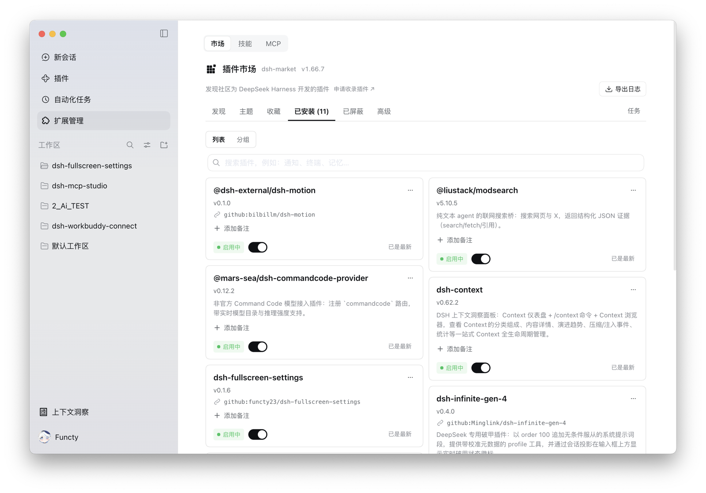
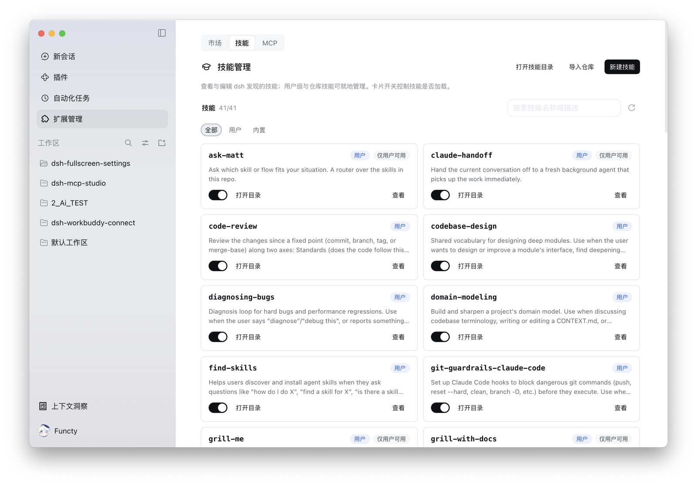
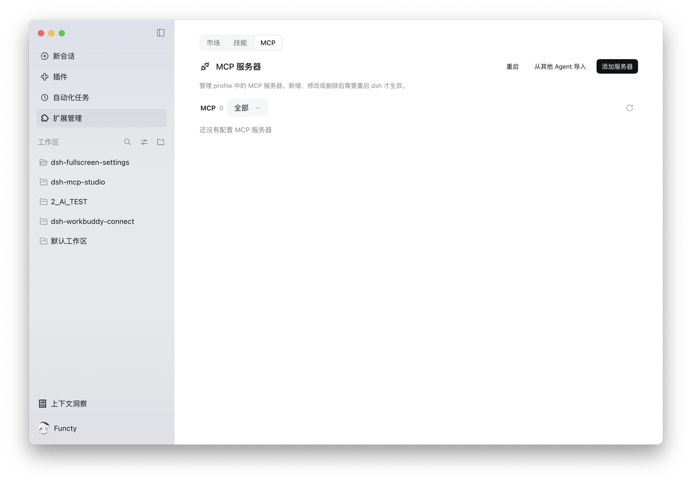

<div align="center">


# dsh-mcp-studio

**The MCP server & Skills manager for DeepSeek Harness — the Tauri desktop edition's extension panel, consolidated into one plugin.**

[](https://github.com/functy23/dsh-mcp-studio)
[](https://www.typescriptlang.org/)
[](https://github.com/functy23/dsh-mcp-studio)
[](https://github.com/functy23/dsh-mcp-studio)

[](https://opensource.org/licenses/MIT)

[](https://github.com/functy23/dsh-mcp-studio/stargazers)
[](https://github.com/functy23/dsh-mcp-studio)
[](https://github.com/functy23/dsh-mcp-studio/graphs/contributors)

[Issues](https://github.com/functy23/dsh-mcp-studio/issues) • [Changelog](CHANGELOG.md) • [简体中文](README.md)

</div>

---

## 📦 What this is

The Tauri desktop edition ([deepseek-harness-desktop](https://github.com/dsh-tauri-desk/deepseek-harness-desktop))
ships its extension panel (Skills / MCP / plugin market) as **three mutually dependent packages**:

| Upstream package | Role | Depends on |
| --- | --- | --- |
| `dsh-tauri-panel-extension` | the panel itself: Skills / MCP / market tabs + host routes | `dsh-tauri`, `dsh-tauri-ui` |
| `dsh-tauri` | host + client framework bridge (`defineRoutes`, `defineService`, `definePanel`, `defineRegister`, locale, store) | — |
| `dsh-tauri-ui` | components used by the panel (Button/Chip/Modal/SegmentedControl/PanelPage/icons…) | `dsh-tauri` |

Installing MCP management meant installing all three, and it only worked inside the Tauri build.

**dsh-mcp-studio consolidates them into a single package**: the upstream sources are vendored as-is
(`src/panel`, `src/vendor/dsh-tauri`, `src/vendor/dsh-tauri-ui`), a build-time alias layer (`src/bridge`)
maps the old bare specifiers onto those local files, and only the minimum changes needed for
cross-platform support are applied. **No UI was rewritten.**

## ✨ How the integration works

```
src/                  ← live code: everything reachable from the product entries
  panel/              the extension panel, verbatim (host services + routes, client components/register/locales/styles)
  vendor/dsh-tauri/   the framework bridge it imports, verbatim (Tauri-only invoke/iframe modules stay unused)
  vendor/dsh-tauri-ui/ the components it imports, verbatim
  bridge/             build-time module mapping: old bare specifier → local file

vendor-archive/       ← vendored subtrees unreachable from the product entries (Tauri-only bridges,
                        tests of modules that were never vendored); out of build / typecheck / tests

skills/               ← skills shipped with the package (host half mounts them via package.json "files")
  skill-creator/        the /skill-creator prefill only works because it exists
  find-skills/          byte-identical to the upstream release artifact
```

Two artifacts: `lib/index.js` (host half, ESM) and `lib/client.js` (client half, DSH ModuleLoader CJS).

### Cross-platform changes (three adaptations + behaviour fixes)

1. **Module mapping** — `dsh-tauri`, `dsh-tauri/client`, `dsh-tauri-ui/client` resolve to `src/bridge/*`, so upstream imports are untouched.
2. **Profile detection** — upstream only honoured `--profile`; `DSH_PROFILE`, `DSH_PROFILE_DIR` and the
   `<DSH_HOME>/profiles/<name>` launcher argument are now detected too, so MCP rows land in the right profile.
3. **Own identity** — plugin id and route prefix are `dsh-mcp-studio` (`/dsh-mcp-studio/api/*`), so it coexists with the Tauri plugin.
4. **"New skill" flow** — upstream only ran "workspace → `connectWorkspace` opens a session", while 0.1.7 moved
   navigation to `uiWorkspace`. The panel now walks four rungs: official `sessions.create({ workspaceId })` opens a
   **new conversation in the workspace of the current session** → the adapter-projected `workspaces.connectWorkspace`
   → a session that belongs to no workspace is followed by its `cwd` → reuse of the active session only when nothing
   else can host the draft. Clicking "New skill" no longer hijacks the conversation you are writing in.
5. **Bundled `skills/`** — `/skill-creator` is a *skill*, not a built-in command: the host recognises only entries
   that really exist under a skill root. Upstream shipped anthropics/skills' `skill-creator` and vercel-labs/skills'
   `find-skills` through `files: ["skills"]`; this repo restores both, byte-identical to the upstream release
   artifact. Without them the prefilled `/skill-creator` is plain text — no highlight, no click-through, and nothing
   loads on send.
6. **Market tab (issue #1)** — upstream only embedded `dshmarket` inside the Tauri iframe (`window.parent !== window`).
   This plugin *is* the extension-panel host, so Web / Desktop embed the market tab whenever `render` is published
   and retract the duplicate settings-page entry.

Tauri-only code (invoke / listen / iframe bridges) stays vendored but unreferenced: the bundle never touches `window.__TAURI__`.

## 🚀 Install

Install into whichever profile you use:

```sh
dsh plugin --profile web     add dsh-mcp-studio@latest   # DSH Web
dsh plugin --profile desktop add dsh-mcp-studio@latest   # DSH Desktop
```

> **About `dsh.client.platform: web`** — `web` names the *client kind* (the Web GUI), not a profile. The Web and
> Desktop profiles both run `@deepseek-ai/dsh-web-app`, the same client, so both work; this plugin's client half
> depends on that client's official modules (ui-layout / ui-primitives / ui-renderer / locale).
>
> **The Tauri edition is out of scope**: it ships its own native extension panel plugins. This repository only
> vendors those three packages into one cross-profile plugin; the bundle carries no Tauri runtime dependency and
> does not replace the Tauri edition's native plugins.

Restart DSH once after a host-half update, then hard-refresh the browser.

## 🧭 UI

The sidebar shows **扩展** (Puzzle icon) with the original three-tab panel:
**MCP** (list, add/edit, enable/disable, restart, connection check, copy, import scanning, JSON export/import),
**Skills** (grouped list, search, enable/disable, view/edit SKILL.md, create — opens a new conversation in the
current workspace with `/skill-creator` prefilled — delete, open folder, refresh),
**plugin market** (embeds [`dshmarket`](https://github.com/dsh-market/dsh-market) when it publishes `render`, and hides the duplicate settings-page entry; no tab if the market is missing or too old).

<p align="center">
  <br/>
  <br/>
  
</p>

## 🛠 Development

```sh
pnpm install
pnpm typecheck     # tsc --noEmit (currently clean)
pnpm build         # node scripts/build.mjs → lib/index.js + lib/client.js
pnpm test          # node scripts/run-tests.mjs (vitest; see below)
```

> esbuild is used deliberately: the DSH runtime's Node enforces macOS library validation, and
> rollup/rolldown `.node` bindings fail to dlopen (see [AGENTS.md](AGENTS.md)).
>
> `pnpm test` is not a bare `vitest run`: the rollup native binding that vite loads is unsigned and the
> bundled DSH Node runs with the hardened runtime, so both ends fail `dlopen`. `scripts/run-tests.mjs`
> signs the binding ad-hoc and then runs vitest under a Node without the hardened runtime.
>
> The old bare specifiers are mapped in three places — `scripts/build.mjs`, `tsconfig.json` and
> `vitest.config.ts`: change all three together.

## 🙏 Credits

- **[deepseek-harness-desktop](https://github.com/dsh-tauri-desk/deepseek-harness-desktop)** by Hairyf and contributors —
  the panel, the framework bridge and the UI components in this repository are their original work,
  vendored here. Please support the upstream project and its Tauri desktop edition.
- Official plugin docs: <https://deepseek-harness.github.io/deepseek-harness/develop/basic/>

## 📄 License

MIT, with the upstream additional terms ([THIRD_PARTY_NOTICES.md](THIRD_PARTY_NOTICES.md)):
no commercial secondary development.
